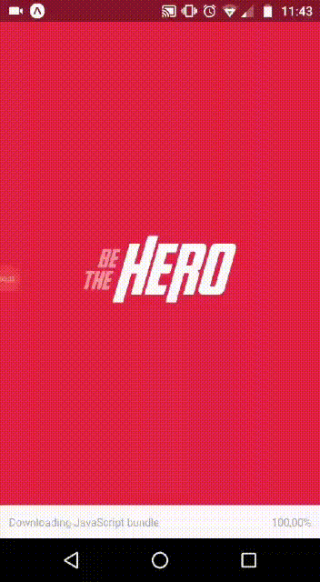

# Be The Hero

Web App and mobile app to connect donnor with institutions that need donation

### Prerequisites

You'll need to install <a href="https://nodejs.org/en/">node.js.<a>

## Running front-end

    

* Step 1 - On your cmd access be the hero folder, then run npm install.
* Step 2 - Access the back end file and run npm start.
* Step 3 - While backend is running, access with another cmd the frontend folder and run npm start.

## Runing mobile

    

* Step 1 - On your cmd access be the hero folder, then run npm install.
* Step 2 - Access the back end file and run npm start.
* Step 3 - Install expo app on you smartphone.
* Step 4 - While backend is running, access with another cmd the mobile folder and run yarn start.
* Step 5 - After the previous step, a QR Code will be generated, read it with your expo app.
