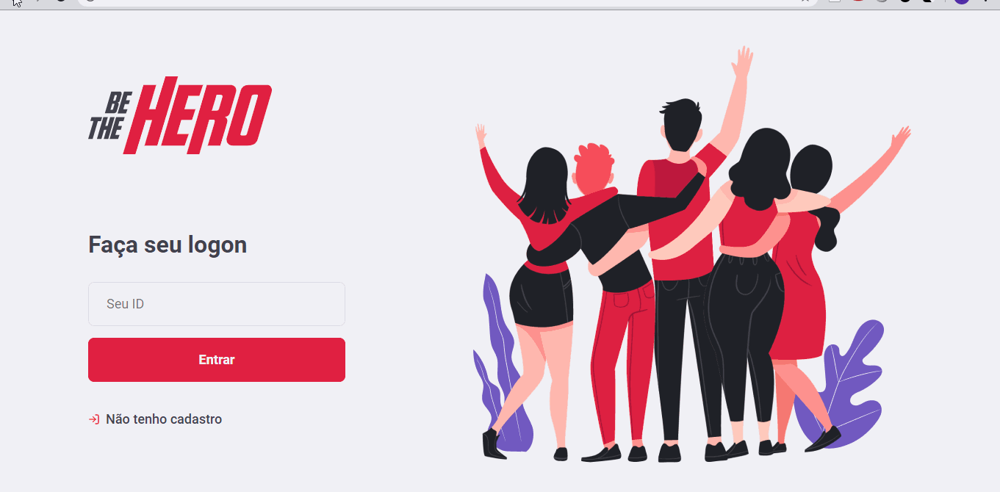

# Be The Hero

Web App and mobile app to connect donnor with institutions that need donation

### Prerequisites

You'll need to install <a href="https://nodejs.org/en/">node.js.<a>

## Running front-end

    

1 - On your cmd access be the hero folder, then run npm install.
2 - Then access the back end file and run npm start.
3 - While backend is running, access with another cmd the frontend folder and run npm start
